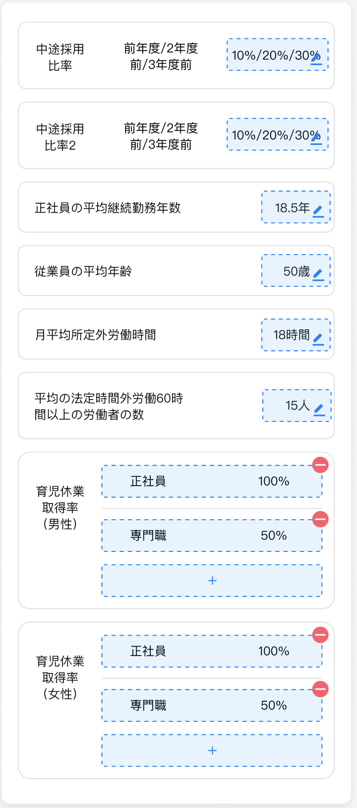

[TOC]

# 面试题

根据提供的基础数据如下图 UI 所示按需实现【曾、删、改】功能，完成后请将代码 clean 掉临时文件后压缩反馈给我们评估。

**注意，注意，注意**：尽可能提高代码复用性，同样的数据结构只摘取了 2 个

## 数据

说明：数据是一个整体，为 Map<String, dynamic>（**可以重组自己需要的数据模型**）

```
Map<String, dynamic> data = 
  {
    // Map<String, Map<String, String>> '10%20%30%' 可以编辑
    '中途採用比率': {'前年度/2年度前/3年度前', '10%20%30%'},
    '中途採用比率2': {'前年度/2年度前/3年度前', '10%20%30%'},
    // Map<String, String> value(如：'18.5年') 可以编辑
    '正社員の平均継続勤務年数': '18.5年',
    '従業員の平均年齢': '50.5岁',
    '月平均所定外労働時間': '18時間',
    '平均の法定時間外労働60時間以上の労働者の数': '15人',
    // Map<String, List<Map<String, String>>> List<Map<String, String>> 可以编辑，可删除 Map<String, String>，并且可以无限增加 Map<String, String>
    '育児休業取得率（男性）': [
      {'正社員': '34%'},
      {'専門職': '50%'},
    ],
    '育児休業取得率（女性）': [
      {'正社員': '34%'},
      {'専門職': '50%'},
    ],
  };
```

## 说明

数据共有 3 种类型：**Map<String, String>**，**Map<String, Map<String, String>>**，**Map<String, List<Map<String, String>>>**，实现时可忽略掉 Map 结构对顺序的影响

1. Map<String, String>： **value 可以修改**
2. Map<String, Map<String, String>>：**Map<String, String> 中的 value 可以修改**
3. Map<String, List<Map<String, String>>>：**List<Map<String, String>> 可以修改、删除、新增**


## UI

[UI 链接](https://www.figma.com/file/ORR9iHhcTfH068OuzQAIKu/Flutter%E6%B5%8B%E8%AF%95%E9%A2%98?node-id=0%3A1)


